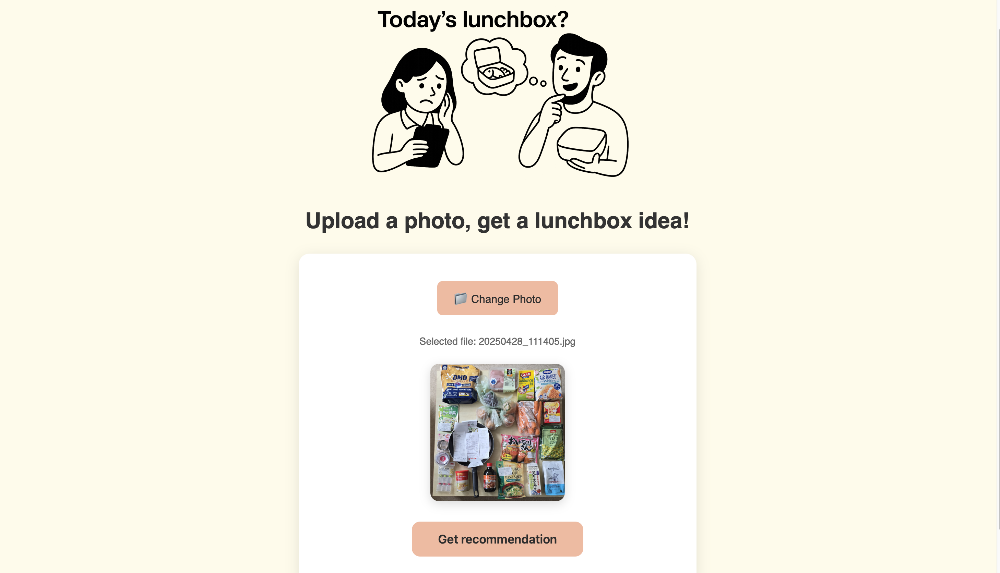
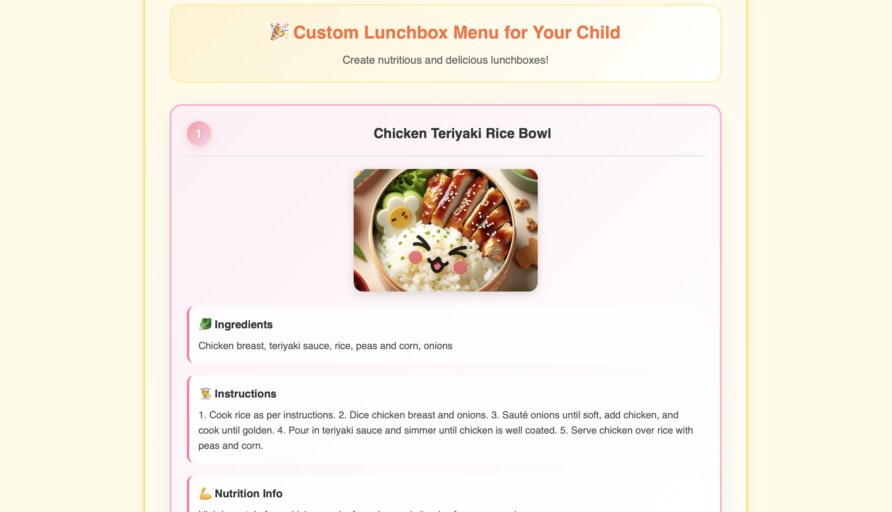

# 🥗 Lunchbox AI – Vision + Prompt POC (Replit Web App)

**Lunchbox AI** is a lightweight web-based AI assistant that helps parents generate nutritious lunchbox ideas for their kids using image-based ingredient input and LLM-powered suggestions.

This project explores the combination of lightweight computer vision, prompt engineering, and multilingual UX in a minimal Python-based interface.

---

## 🚀 Features

- 📷 **Image-based input UI** (drag-and-drop or select from gallery)
- 🧠 **LLM prompt-driven meal suggestions** using OpenAI or Claude API
- 🌐 **Multilingual support** – Automatically detects browser language (English/Korean)
- 🖼 **Auto-generated lunchbox UI cards** with ingredients, recipe steps, and nutrition info
- 💡 Designed to simulate real-world parenting scenarios

---

## 🛠 Tech Stack

| Category | Stack |
|---------|-------|
| Backend | Python 3.10+ (Flask 2.2.0) |
| Frontend | HTML5, CSS3, Vanilla JavaScript, Jinja2 templates |
| AI/LLM | OpenAI GPT-4o API (gpt-4o model) |
| Image Generation | DALL-E 3 API |
| Vision Processing | OpenAI Vision API (base64 image analysis) |
| Async Processing | Python asyncio for concurrent image generation |
| Deployment | Replit (Cloud Run) |
| Dependency Management | Poetry |
| Development Environment | Replit IDE with Nix package management |

---

## 📸 Demo Screenshots



---

## ▶️ Run Locally

```bash
# Optional: Create and activate virtual env
python3 -m venv venv
source venv/bin/activate

# Install dependencies
pip install -r requirements.txt

# Run app
python main.py
